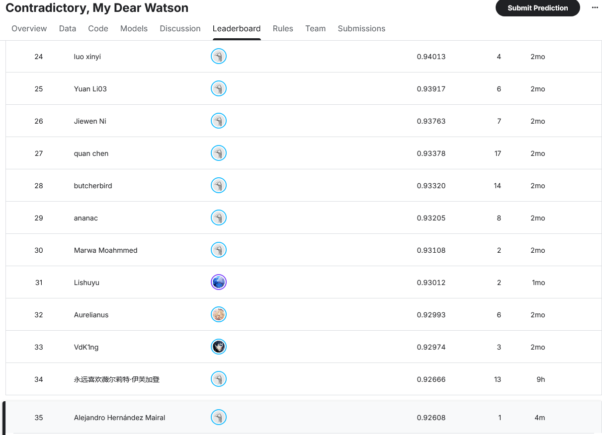

# Contradictory, My Dear Watson

PyTorch + Hugging Face Transformers NLI (Natural Language Inference) notebook for the Kaggle competition [Contradictory, My Dear Watson](https://www.kaggle.com/competitions/contradictory-my-dear-watson), which involves classifying premise/hypothesis sentence pairs in 100+ languages as *entailment*, *neutral*, or *contradiction*.

All the work lives in [`watson-notebook.ipynb`](watson-notebook.ipynb).

## Results

| Model | val_accuracy | Notes |
|---|---|---|
| `bert-base-multilingual-cased` (baseline) | ~65.9% | Generic masked-LM, not pretrained for NLI. Full fine-tuning, 2 epochs. |
| `mDeBERTa-v3-base-mnli-xnli` + translation-based data augmentation (`model_nli_aug`) | 88.4% | |
| `mDeBERTa-v3-base-xnli-multilingual-nli-2mil7` (alternative checkpoint) | 87.2% | Experiment: more NLI pretraining doesn't beat `model_nli_aug`. |
| `xlm-roberta-large-xnli` (2x larger backbone, `model_nli_large`) | **93.0%** | Best model — the one that generates `submission.csv`. |

## Notebook structure

1. **Baseline**: full fine-tuning of `bert-base-multilingual-cased`, fixed 2 epochs, no frozen layers.
2. **Transfer learning with mDeBERTa**: starts from [`MoritzLaurer/mDeBERTa-v3-base-mnli-xnli`](https://huggingface.co/MoritzLaurer/mDeBERTa-v3-base-mnli-xnli), already fine-tuned on MNLI+XNLI. Freezes embeddings + the 9 lower encoder layers, trains only the top 3 layers plus a new classifier head (7.6% of parameters), with LR warmup+decay, gradient clipping, and early stopping. The change with the biggest impact on the result was raising `max_len` from 50 to 128 — at 50, mDeBERTa's tokenizer truncated 45.8% of the examples.
3. **Per-language analysis and translation augmentation**: identifies the worst-served languages (Russian, Thai, Turkish) and tries augmenting data via translation (`facebook/nllb-200-distilled-600M`), ensembling, domain-adaptive pretraining on Thai, data leakage verification, checkpoint averaging (SWA-style), and gradual encoder unfreezing.

Full details of each experiment, numeric results, and lessons learned (what improved, what didn't, and why) are in [`CLAUDE.md`](CLAUDE.md).

## Current status (2026-07-21)

Accuracy-improvement work complete, with `submission.csv` regenerated from the best of three candidates:

- **Fixed a real bug**: `submission.csv` was being generated with the baseline model (~65.9%), not the best trained model — no cell in the transfer-learning sections re-generated predictions on `test.csv`.
- **Alternative checkpoint experiment** (`mDeBERTa-v3-base-xnli-multilingual-nli-2mil7`, same size, more NLI pretraining): negative result, 87.2% vs. 88.4% for `model_nli_aug`.
- **Larger-backbone experiment** (`xlm-roberta-large-xnli`, ~560M parameters vs. mDeBERTa's ~278M): **93.0%**, +4.6 points over `model_nli_aug` — the best result by far, and the one now generating `submission.csv`. This contradicts the lesson from the gradual-unfreezing experiments (more trainable capacity within the same backbone didn't raise the ceiling): a genuinely different, larger backbone did.
- Training the large backbone used `batch_size=8` with gradient accumulation (effective batch size 32) to keep memory usage manageable.
- Uploading to Kaggle requires [`kaggle-submission.ipynb`](kaggle-submission.ipynb) (this competition requires a notebook executed inside Kaggle's own environment, not a direct CSV upload) — see [`CLAUDE.md`](CLAUDE.md) for the manual setup steps.

## Kaggle leaderboard result

After running `kaggle-submission.ipynb` on Kaggle and submitting the prediction, the model scored **0.92608** on the competition's public leaderboard — consistent with the ~93.0% val_accuracy measured locally.

## Future work

- **Knowledge distillation**: `model_nli_large` (`xlm-roberta-large-xnli`, ~560M parameters) is the best-scoring model, but it's 2x the size of the mDeBERTa-based candidates. Distilling it into a smaller student model is worth trying, to see how much of the +4.6pt accuracy gain over `model_nli_aug` can be kept while cutting parameter count.

## Data

The `train.csv`, `test.csv`, and `sample_submission.csv` files are not included in this repo (they're the Kaggle competition data). Download them from the [competition's data page](https://www.kaggle.com/competitions/contradictory-my-dear-watson/data) and place them in the project root before running the notebook.

## Environment

The project uses a dedicated Python venv (not conda) with versions pinned in [`requirements.txt`](requirements.txt), including a CUDA-enabled PyTorch build (`+cu126`) for GPU training. Full setup and execution instructions are in [`CLAUDE.md`](CLAUDE.md).
